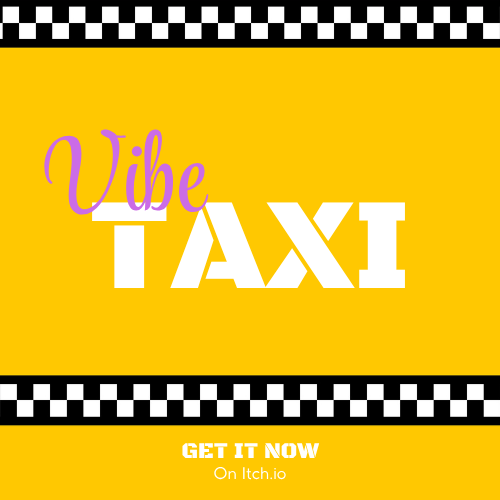

  

---

<h1 align="center">VibeTaxi</h1>

  

VibeTaxi is a top-down driving **videogame** where you work as a taxi driver, with a slow car. The game's gimmick is music, once you pay attention to what the passenger has to say, you tune the right music on the radio and enter the Vibe Mode, where you drive faster and unlock drifting.

Made as Project for the course of Videogame Programming I I2026 semester at the Universidad de los Andes (ULA)

The application is developed in **Python**, with [Pygame](https://www.pygame.org/news) and [GALE](https://github.com/R3mmurd/Gale/tree/main) as the main dependencies.

Available on [itch.io](https://jaludex.itch.io/vibe-taxi)

  

# Features

  

-  **Game modes**: 
	- **WorkDay**: Deliver the max amount of passengers in 3 minutes, pay the increasing daily fee, then use the leftover money to repair your car and start another day.
	- **Arcade**: Start with 2 minutes, each time you deliver a passenger, it gives you more time, play until time's out
	- **Zen**: Relaxing mode, drive always in vibe mode, don't worry about time. 

- Local **statistics** to compare records of most days survived or most passengers delivered.

- **Game saving** for a WorkDay run, after each day, you can save and exit, if your lose, the save is deleted and your record is saved if it's good enough

-  **Smooth Driving** with your mouse.

- Arcade **Drifting** .

- **Custom City** with Props and Traffic.

-  **Guided tutorial** to learn about the game.

# Installation

Go to the Release section, find the latest release, download the one specified for your system, extract it, find the executable VibeTaxi or VibeTaxi.exe and run it. 

  

# Running it from source

## Requirements
-   Python 3.12+
-   A single dependency shared by every project: [`gale-engine`](https://pypi.org/project/gale-engine/) (which in turn depends on Pygame).

  

## Running the game

Get a copy of the latest source code from the releases section and extract it or clone the repository. To clone the repository, run:

  

    git clone https://github.com/Jaludex/VibeTaxi.git

If cloning was successful, you will see that files and directories have appeared.
Then install  [GALE](https://github.com/R3mmurd/Gale/tree/main) with

    pip install gale-engine
After that, from the root of the repository, run:

    ./vibetaxi/main.py

  And the game is running

# Licensing

The project is licensed under the terms of the MIT License. You can find a copy of the license in the "LICENSE" file.

# Credits
All assets not made by us are from copyright-free sources.

## Development & Design:

 - Jesús León ([Jaludex](https://github.com/Jaludex))
 - Zadkiel Jiménez ([Eltoti](https://github.com/zjk-2206))

## Music & Sound Effects:

 - [Pixabay](https://pixabay.com/es/) 
 - [OpenGameArt](https://opengameart.org/)
 - Text blips by [dmochas](https://dmochas-assets.itch.io/dmochas-bleeps-pack) on itch.io

## Graphical Assets:

 - Radio, indicator arrow and passenger UI by Eltoti 
 - City Assets by [nyknck](https://nyknck.itch.io/citypackpixelart) on itch.io 
 - Cars textures by [Kia](https://kia.itch.io/32x32-car-sprites) on itch.io 
 - Peds texture by [vimlark](https://vimlark.itch.io/town-asset-pack-16x16) on itch.io 
 - Fonts taken from Google Fonts

  

## Special Thanks

Just like in my previous game... Thanks to our teacher and our tutors in this course, they are incredible.

